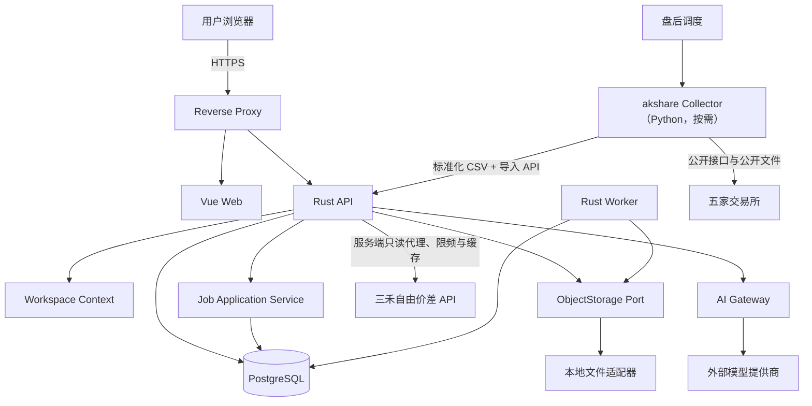
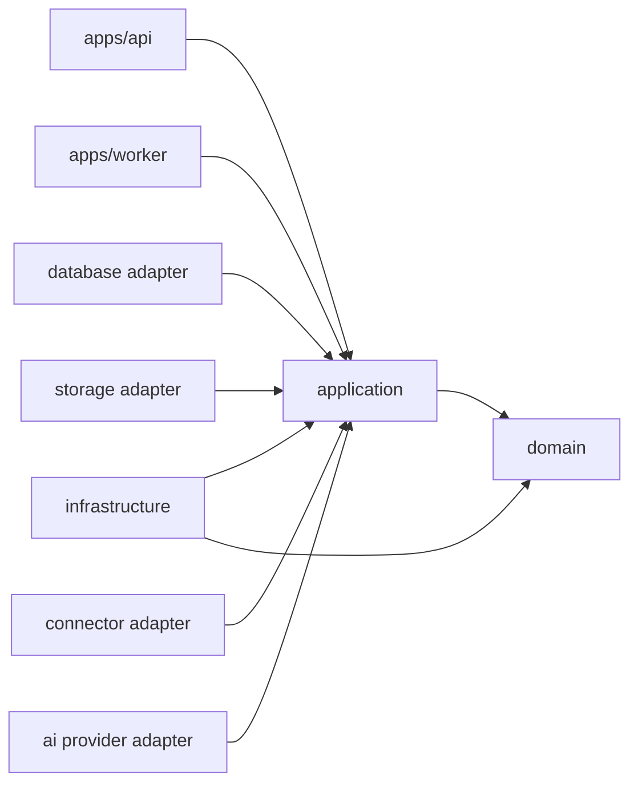
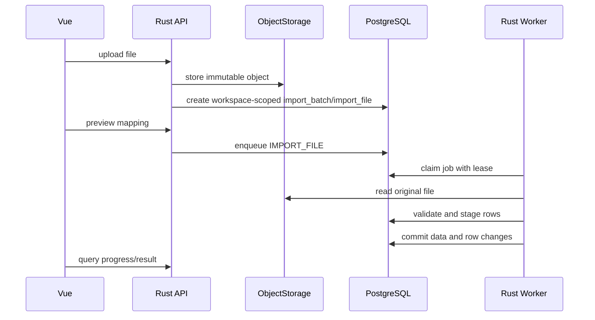

# 总体架构

## 1. 架构结论

采用“模块化单体 + 按需 akshare 采集器”的架构：

- `api` 与 `worker` 共享同一 Rust 领域和应用层代码，作为同一后端系统发布。
- PostgreSQL 同时承载业务数据、事务性任务队列和审计记录。
- 业务数据归属于个人 Workspace；所有业务查询、写入、任务、文件对象和 AI 工具必须携带服务端解析的 `workspace_id`。
- 文件通过 `ObjectStorage` 端口访问；第一版实现本地存储适配器。
- 自动采集由独立 Python akshare 容器执行，按需拉起、跑完退出；容器输出标准化 CSV 后只通过导入 API 入库。
- Phase 5 自由价差由 Rust API 内的 `SpreadSeriesProvider` 读取；首发 `sanhe` 适配器仅代理 `DEC-042` 的三个三禾只读 POST 端点，自有 `self_hosted` 实现读取本库行情。
- PNG/SVG 由 ECharts 前端直接导出，不建设服务端图表渲染辅助进程。
- AI 通过应用层只读工具访问业务能力，不直接访问数据库。

“模块化单体”指领域与应用代码不拆分为网络服务；akshare 采集器是受网络白名单约束的按需数据获取进程，不承载平台领域逻辑。

## 2. 上下文图

反向代理固定采用 Nginx：`/` 提供 Vue 前端，`/api/` 转发 Axum API，`/events/` 支持 SSE。

## 3. 依赖方向

约束：

- `domain` 不依赖 Axum、SQLx、akshare、文件系统或具体 AI SDK。
- `application` 定义用例和端口，只依赖 `domain`。
- `application` 的所有业务用例显式接收 `WorkspaceContext`，仓储方法不得省略 `workspace_id`。
- `infrastructure`、`database` 和各适配器实现端口。
- `apps/api` 与 `apps/worker` 只负责组合依赖、协议适配和生命周期。
- 业务模块不得直接拼接文件路径或执行任意 SQL。

## 4. 核心数据流

### 4.1 文件导入

手动文件导入在正式写入前必须完成预览确认；`overwrite` 必须同时记录旧值，才能满足回滚要求。白名单自动采集批次使用固定映射模板版本，跳过人工预览与确认；解析或校验失败时隔离为 `failed` 且正式表零写入，质量警告仅记录、不拦截。

回滚开始前必须在同一事务中检查批次后续修改和下游依赖。发现任一冲突时中止整个回滚；不执行部分回滚，纠错通过引用原批次的补偿批次完成。

### 4.2 价差计算

`workspace-scoped market_price → contract/calendar normalization → price_basis/formula_version → aligned leg samples → spread_observation → statistics → chart`

缺失腿、时间不一致和来源冲突必须产生显式状态，不允许自动补值后伪装成原始数据。

- 时间点以 UTC/`timestamptz` 保存，交易日期使用交易所日历计算的 `trade_date`。
- 夜盘记录为独立 `session_type`，并归入交易所日历定义的下一交易日。
- 行情图默认 `price_basis=close`；日终持仓、未实现盈亏和权益默认 `price_basis=settlement`。
- MVP 不生成连续合约；外部连续合约通过来源与换月规则元数据进入。
- Phase 5A 的三禾序列没有原始腿价格，必须如实使用 `price_basis=upstream_spread`；
  按实际合约代码和本库交割月执行版本化散户可交易窗口裁剪后，再在服务端重算季节图
  与月度矩阵。详细边界见 `docs/phases/PHASE_05_SPREAD_ANALYTICS.md`。
- `SpreadSeriesProvider` 隔离 `sanhe` 与 `self_hosted`；UI 和响应始终披露真实 provider、
  source、取数时间、样本范围和算法版本。

### 4.3 akshare 自动采集

`盘后调度 → 按需启动 akshare collector → 五交易所公开接口/文件 → 标准化 CSV → 导入 API → 固定模板校验 → 正式表`

- 采集器是独立 Python 容器，每交易日盘后按需运行，完成后退出，不常驻。
- 第一批一次覆盖 DCE、SHFE、CZCE、GFEX、CFFEX；东方财富等二手数据源不进入第一批。
- 数据获取路径固定为 akshare 封装的交易所公开接口与公开文件，不接受任意目标 URL。
- 采集范围为全市场日行情、全市场席位龙虎榜、交易日历和合约参数；历史回填策略遵循 `DEC-039`。
- 标准化 CSV 经导入 API 入库，来源、采集任务、导入批次、变更日志和回滚链完整保留。
- 自动批次按 `DEC-038` 免人工确认、免提取预览；失败批次自动隔离，数据质量警告仅记录、不拦截。

### 4.4 AI 查询

`user session → WorkspaceContext → permission check → prompt policy → workspace-scoped read-only tool → provenance bundle → model explanation → audited answer`

从网页、文件和笔记读取的文本均视为不可信数据，不能覆盖系统工具策略。

## 5. 后台任务语义

PostgreSQL 队列使用“至少一次”语义，不声称 exactly-once：

- Worker 以 `FOR UPDATE SKIP LOCKED` 获取任务。
- 使用租约、心跳、最大尝试次数和退避策略。
- 每类任务定义 `idempotency_key` 和可重入边界。
- 任务载荷带 `payload_version`。
- 超过最大次数进入 `dead_letter` 状态，需人工处理。
- 任务成功与业务写入尽量在同一事务内提交；无法同事务时使用可恢复状态机。

## 6. 文件与数据库一致性

- 文件先以不可变对象写入，成功后再创建数据库引用。
- 对象元数据和对象键必须绑定 `workspace_id`，跨 Workspace 不得复用可猜测引用。
- 数据库事务失败时，无引用对象由清理任务按宽限期回收。
- 删除业务记录不立即删除原始文件；按保留策略标记并延迟回收。
- 备份必须同时覆盖 PostgreSQL、对象文件和主密钥材料。

## 7. 架构冲突与修正

| 编号 | 原方案问题 | 修正 |
| --- | --- | --- |
| `ARC-R01` | 阶段表先做交易持仓，结论又要求先做导入 | 开发计划统一为基础数据与导入优先 |
| `ARC-R02` | “模块化单体”与多个独立服务表述易混淆 | 领域单体；仅保留按需 akshare 采集器作为独立数据获取进程 |
| `ARC-R03` | 旧方案为浏览器采集和服务端图表导出设置高成本隔离进程 | 按 `DEC-031`、`DEC-040` 移除两者；采集改为 akshare，图表改为 ECharts 前端导出 |
| `ARC-R04` | 任意 URL + 自动发现无法稳定落地 | 固定五交易所白名单和 akshare 封装的公开接口/文件 |
| `ARC-R05` | PostgreSQL 年/月分区被当作默认方案 | MVP 先以索引和容量指标验证，分区设计待数据量证明 |
| `ARC-R06` | SSE 与 WebSocket 并列但职责不明 | 普通任务进度和 AI 流式回复使用 SSE；不再为采集引入 WebSocket |
| `ARC-R07` | `pgvector` 被提及但未列入已确认技术基线 | 结构化金融数据不使用向量检索；文档和交易笔记才使用 `pgvector` |
| `ARC-R08` | 手动导入确认规则直接套用自动采集会增加无意义操作 | `DEC-038` 允许白名单结构化自动批次跳过预览/确认，以失败隔离、回滚和质量警告兜底 |
| `ARC-R09` | 采集阶段过晚，套利开发缺少真实数据 | Phase 4 提前完成五交易所采集与全历史回填，Phase 5 再开发套利与图表 |

## 8. 主要质量属性

- 正确性优先于采集自动化率。
- Workspace 强制隔离优先于客户端传参便利性。
- 数据沿袭优先于缓存统计结果。
- 采集容器网络最小化优先于开放通用外部访问能力。
- 幂等和可恢复优先于追求“只执行一次”。
- 单机可部署，但不以牺牲备份、密钥和审计为代价。

### 8.1 资源结论

- 裁剪后，现有 1GB 内存、25G 磁盘的 VPS 支撑全部阶段；五个核心容器实测内存合计约 310MB。
- 唯一明确的磁盘增长点是席位全历史数据，估算 5–15GB；磁盘达到 80% 水位时扩容 VPS 磁盘，不更换机器。
