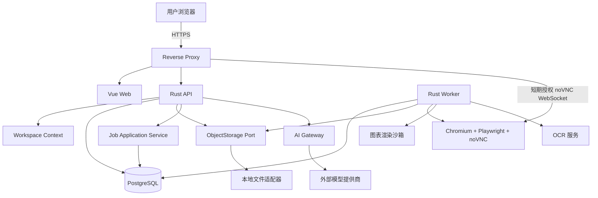
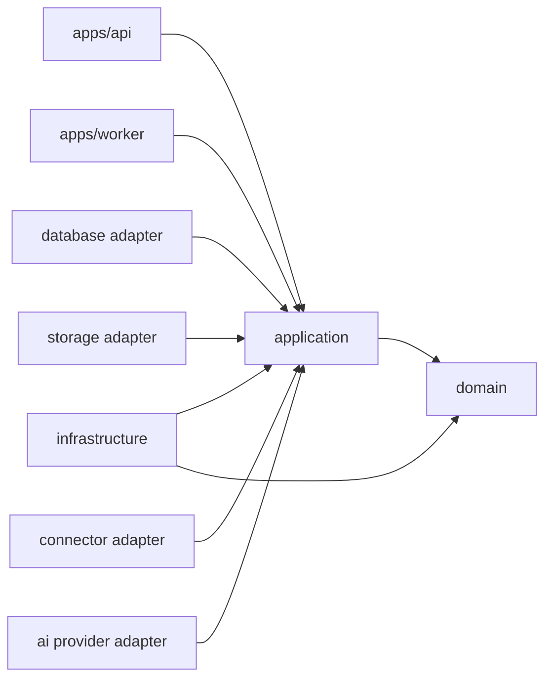
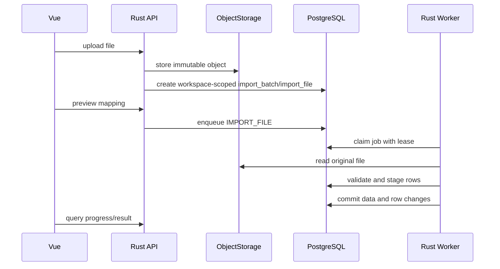

# 总体架构

## 1. 架构结论

采用“模块化单体 + 独立受限辅助进程”的架构：

- `api` 与 `worker` 共享同一 Rust 领域和应用层代码，作为同一后端系统发布。
- PostgreSQL 同时承载业务数据、事务性任务队列和审计记录。
- 业务数据归属于个人 Workspace；所有业务查询、写入、任务、文件对象和 AI 工具必须携带服务端解析的 `workspace_id`。
- 文件通过 `ObjectStorage` 端口访问；第一版实现本地存储适配器。
- 浏览器采集、静态图表渲染和 OCR 属于不同信任边界，应使用独立容器或独立沙箱，不能共享高权限浏览器上下文。
- AI 通过应用层只读工具访问业务能力，不直接访问数据库。

“模块化单体”指领域与应用代码不拆分为网络服务，不代表 Playwright 和 OCR 必须嵌入 Rust 进程。

## 2. 上下文图

反向代理固定采用 Nginx：`/` 提供 Vue 前端，`/api/` 转发 Axum API，`/events/` 支持 SSE，noVNC 使用独立受控路径和 WebSocket 代理。

## 3. 依赖方向

约束：

- `domain` 不依赖 Axum、SQLx、Playwright、文件系统或具体 AI SDK。
- `application` 定义用例和端口，只依赖 `domain`。
- `application` 的所有业务用例显式接收 `WorkspaceContext`，仓储方法不得省略 `workspace_id`。
- `infrastructure`、`database` 和各适配器实现端口。
- `apps/api` 与 `apps/worker` 只负责组合依赖、协议适配和生命周期。
- 业务模块不得直接拼接文件路径或执行任意 SQL。

## 4. 核心数据流

### 4.1 文件导入

正式写入前必须完成预览确认；`overwrite` 必须同时记录旧值，才能满足回滚要求。

回滚开始前必须在同一事务中检查批次后续修改和下游依赖。发现任一冲突时中止整个回滚；不执行部分回滚，纠错通过引用原批次的补偿批次完成。

### 4.2 价差计算

`workspace-scoped market_price → contract/calendar normalization → price_basis/formula_version → aligned leg samples → spread_observation → statistics → chart`

缺失腿、时间不一致和来源冲突必须产生显式状态，不允许自动补值后伪装成原始数据。

- 时间点以 UTC/`timestamptz` 保存，交易日期使用交易所日历计算的 `trade_date`。
- 夜盘记录为独立 `session_type`，并归入交易所日历定义的下一交易日。
- 行情图默认 `price_basis=close`；日终持仓、未实现盈亏和权益默认 `price_basis=settlement`。
- MVP 不生成连续合约；外部连续合约通过来源与换月规则元数据进入。

### 4.3 网页采集

`whitelisted connector → isolated Chromium/noVNC session → raw snapshot → extraction preview → human confirmation → import batch`

浏览器所有主请求、重定向、子资源、WebSocket 和下载都必须受出口策略约束。

- MVP API 不接受任意目标 URL，只接受已配置的 `data_source_id` 和连接器操作。
- 每个 `workspace_id + data_source_id` 使用独立 Browser Context。
- 第一批启用交易所公开数据连接器；三禾连接器保持禁用，直至授权范围获得记录。
- 提取顺序固定为官方 API、网络请求、HTML 表格、下载文件、OCR；OCR 结果必须人工确认。

### 4.4 AI 查询

`user session → WorkspaceContext → permission check → prompt policy → workspace-scoped read-only tool → provenance bundle → model explanation → audited answer`

从网页、文件和笔记读取的文本均视为不可信数据，不能覆盖系统工具策略。

## 5. 后台任务语义

PostgreSQL 队列使用“至少一次”语义，不声称 exactly-once：

- Worker 以 `FOR UPDATE SKIP LOCKED` 获取任务。
- 使用租约、心跳、最大尝试次数和退避策略。
- 每类任务定义 `idempotency_key` 和可重入边界。
- 任务载荷带 `payload_version`。
- 超过最大次数进入 `dead_letter` 状态，需人工处理。
- 任务成功与业务写入尽量在同一事务内提交；无法同事务时使用可恢复状态机。

## 6. 文件与数据库一致性

- 文件先以不可变对象写入，成功后再创建数据库引用。
- 对象元数据和对象键必须绑定 `workspace_id`，跨 Workspace 不得复用可猜测引用。
- 数据库事务失败时，无引用对象由清理任务按宽限期回收。
- 删除业务记录不立即删除原始文件；按保留策略标记并延迟回收。
- 备份必须同时覆盖 PostgreSQL、对象文件和主密钥材料。

## 7. 架构冲突与修正

| 编号 | 原方案问题 | 修正 |
| --- | --- | --- |
| `ARC-R01` | 阶段表先做交易持仓，结论又要求先做导入 | 开发计划统一为基础数据与导入优先 |
| `ARC-R02` | “模块化单体”与多个独立服务表述易混淆 | 领域单体；浏览器/OCR/渲染为受限辅助进程 |
| `ARC-R03` | 采集与图表均使用 Playwright，复用会扩大权限 | 分离容器、浏览器上下文、网络和凭据 |
| `ARC-R04` | 任意 URL + 自动发现无法稳定落地 | 只支持授权站点连接器和人工确认 |
| `ARC-R05` | PostgreSQL 年/月分区被当作默认方案 | MVP 先以索引和容量指标验证，分区设计待数据量证明 |
| `ARC-R06` | SSE 与 WebSocket 并列但职责不明 | 普通任务进度和 AI 流式回复使用 SSE；noVNC 使用 WebSocket |
| `ARC-R07` | `pgvector` 被提及但未列入已确认技术基线 | 结构化金融数据不使用向量检索；文档和交易笔记才使用 `pgvector` |

## 8. 主要质量属性

- 正确性优先于采集自动化率。
- Workspace 强制隔离优先于客户端传参便利性。
- 数据沿袭优先于缓存统计结果。
- 隔离优先于复用浏览器基础设施。
- 幂等和可恢复优先于追求“只执行一次”。
- 单机可部署，但不以牺牲备份、密钥和审计为代价。
