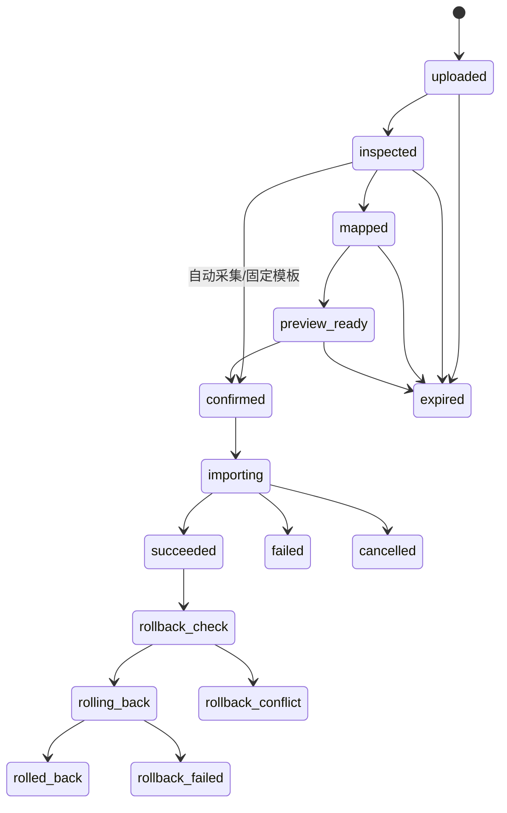

# 导入设计

## 1. 目标

导入中心是 MVP 的第一业务能力。它必须做到可预览、可复核、可重试、可追溯和可回滚，并作为手动文件导入与 akshare 自动采集的统一数据入口。

所有批次、文件、staging 行、错误、变更和正式数据都归属于当前 `workspace_id`；Workspace 由服务端 session 或已绑定 Workspace 的后台任务解析。

## 2. 支持范围

- 格式：TXT、CSV、XLS、XLSX。
- 编码：至少覆盖 UTF-8 和常见中文编码；自动检测结果必须显示置信度并允许人工覆盖。
- 分隔符：逗号、制表符、分号、竖线、空格及用户指定值。
- Excel：选择工作表和表头行；识别日期序列值；提示合并单元格、隐藏行、公式和混合类型。
- 第一版不执行宏、外部链接、公式或嵌入对象。
- 金融字段按确定精度解析：`price/spread` 为 `numeric(20,8)`，`money/fee/pnl` 为 `numeric(24,4)`，`ratio` 为 `numeric(20,10)`，`lots` 为 `bigint`。
- 时间点转换为 UTC `timestamptz`；市场数据同时要求 `trade_date`、`session_type` 和交易日历版本。

文件大小、最大行列、工作表数、解析超时和 staging 保留时间待容量确认。

## 3. 状态机

规则：

- `confirmed` 后映射、冲突策略和源文件不可变。
- 自动采集批次由固定模板直接进入 `confirmed`，不创建人工 preview/confirm 等待点；手动批次仍按完整状态流转。
- `succeeded` 才能回滚；同一批次只能成功回滚一次。
- 回滚检查发现任一后续修改或下游引用时，整个批次进入 `rollback_conflict`，不得修改任何正式数据。
- 取消只在任务定义的安全检查点生效。
- `failed` 保留错误报告和已提交状态；正式数据不得部分静默成功。

## 4. 处理流程

1. 上传文件到隔离对象区，计算 SHA-256。
2. 校验 magic bytes、MIME、格式边界和安全限制。
3. 识别编码、分隔符、工作表、表头和候选数据集。
4. 用户选择数据集类型和字段映射。
5. 生成前 50 行预览，同时执行全文件轻量结构扫描。
6. 规范化为 staging 行，运行字段、跨字段和业务唯一键校验。
7. 展示新增、重复、冲突、错误和警告计数。
8. 用户确认冲突策略；系统冻结 `mapping_version` 和参数。
9. 后台任务以当前 `workspace_id` 流式解析，写入 staging/正式表和 `import_row_changes`。
10. 生成导入报告，并使相关统计缓存失效或创建重算任务。

自动采集批次跳过步骤 4–8 的人工环节，映射使用固定模板版本。白名单结构化采集数据免人工确认、免提取预览，直接进入正式表；解析或校验失败时批次自动隔离为 `failed` 且正式表零写入，数据质量警告仅记录、不拦截。手动文件导入的既有流程不变。

## 5. 字段映射

- 映射目标字段使用英文 `snake_case`。
- 同义源字段可以映射到同一目标字段，例如“日期”“交易日”“date”到 `trade_date`。
- 映射模板按 `dataset_type` 版本化，旧批次始终引用原版本。
- 转换操作使用受控枚举，不允许用户上传或执行任意脚本。
- 必填、默认值、日期格式、单位和枚举转换必须显示在预览中。
- 原始单元格文本保留在 `raw_json`，规范化结果写入 `normalized_json`。
- 市场数据映射必须分别处理 `close_price`、`settlement_price`、`trade_date`、`session_type`、`currency_code` 和来源；不得把价格口径压缩成未标识的单一 `price`。

## 6. 校验层级

| 层级 | 示例 | 结果 |
| --- | --- | --- |
| 文件 | 格式伪造、压缩炸弹、超限 | 拒绝整个文件 |
| 结构 | 缺少表头、列数异常 | 阻止确认 |
| 字段 | 日期、数值、枚举无效 | 行级错误 |
| 跨字段 | `expires_at < listed_at` | 行级错误 |
| 目录引用 | 合约不存在 | 错误或人工映射 |
| 业务唯一键 | 已存在同来源记录 | 进入冲突策略 |
| 数据质量 | 价格跳变、非交易日 | 警告；自动采集仅记录、不拦截 |

警告不等于错误；用户必须能看到被允许提交的警告。

## 7. 冲突策略

| 策略 | 语义 | 约束 |
| --- | --- | --- |
| `skip` | 保留现有记录，跳过新行 | 记录冲突 |
| `overwrite` | 以新值创建受审计修订 | 必须记录完整旧值 |
| `keep_both` | 保留多个来源或修订 | 仅允许数据模型支持时使用 |
| `abort` | 任一冲突终止整个批次 | 正式表零变更 |

不得对所有数据集无条件开放 `keep_both` 或 `overwrite`。每个数据集定义业务唯一键和允许策略。

`trade_fills` 明确禁止 `overwrite`。原始成交纠错必须创建冲销/补偿成交记录，并通过引用字段连接原记录。

## 8. 事务、分块与幂等

- 小批次在单事务内写入正式数据、变更日志和批次状态。
- 大批次如必须分块，先写 staging，再以可恢复提交协议进入正式表；分块边界和恢复规则必须在性能测试后确定。
- `idempotency_key` 至少包含 `workspace_id`、批次、文件哈希、映射版本和确认参数摘要。
- Worker 重试时已提交行不得重复写入。
- 统计重算与导入提交通过 outbox/job 记录连接，避免业务提交成功但任务丢失。

## 9. 回滚

回滚首先在单一事务中锁定批次并检查全部 `import_row_changes`、目标行版本和下游引用。只有检查全部通过，才按 `sequence_no` 逆序执行：

- `insert`：删除或软删除该批次创建且之后未被合法修改的记录。
- `update`：验证当前版本后恢复 `before_json`。
- `soft_delete`：恢复删除前状态。

如果任一目标记录在导入后被其他操作修改，或已被价差、交易组、图表、报告等对象引用，则中止整个回滚并返回完整冲突清单。已经检查通过的行也不得先行回滚。

系统不支持部分回滚。用户需要纠错时创建新的补偿批次；补偿批次通过 `compensates_batch_id` 引用原批次，并执行完整预览、确认、审计和幂等流程。

回滚后：

- 标记批次 `rolled_back`。
- 使派生统计、图表和报告失效。
- 创建受影响范围的重算任务。
- 保留原始文件、导入报告、变更日志和回滚审计。

## 10. 错误代码

- `unsupported_format`
- `mime_mismatch`
- `file_too_large`
- `decompression_limit_exceeded`
- `encoding_detection_failed`
- `delimiter_detection_failed`
- `sheet_limit_exceeded`
- `header_not_found`
- `required_field_missing`
- `invalid_date`
- `invalid_decimal`
- `unknown_contract`
- `duplicate_in_file`
- `conflict_with_existing`
- `rollback_conflict`
- `parse_timeout`

错误信息使用中文，代码保持英文稳定。

## 11. 导入报告

报告至少包含：

- 文件名、SHA-256、大小、格式、编码、工作表。
- 数据集类型、映射版本、冲突策略，以及手动确认人或自动采集模式标识。
- 总行数、新增、更新、跳过、冲突、错误、警告。
- 开始/完成时间、任务尝试次数和关联 ID。
- 错误样例和完整错误文件引用。
- 回滚状态和受影响派生数据。
- `workspace_id`、补偿批次引用和回滚冲突清单。

## 12. 验收重点

- 同一文件和参数重复提交不产生重复正式数据。
- 任一正式记录可追溯到文件、行号、映射和批次。
- 覆盖导入可恢复旧值；存在后续修改时不会错误覆盖。
- 存在后续修改或依赖时整批零变更，不出现部分回滚。
- 补偿批次可追溯到原批次，并保持 Workspace 隔离。
- 异常文件在限制内失败，不耗尽内存或磁盘。
- 白名单自动采集批次使用固定模板、免人工确认；失败隔离、警告留痕、重试幂等和整批回滚符合 `DEC-038`。
